# images

What tokbin costs, where the time goes, and where the limits are. Numbers come from
the scripts in [`benchmarks/`](../benchmarks/README.md); every sample is kept in
`benchmarks/results/*.json`, and the charts are drawn from those files.

This page reports what was measured, including the unflattering parts. When a
number is uncertain, the uncertainty is stated next to it.

## Setup

| | |
|---|---|
| Machine | Apple M4 Pro (8 performance + 4 efficiency cores), 24 GB RAM, internal SSD, APFS |
| Software | macOS 26 (Darwin 25.6), Python 3.12.9, numpy 2.5.1, tokenizers 0.23.1, torch 2.14 |
| tokbin | 0.1.0.dev0, commit `42ffc5e` |
| Data | TinyStoriesV2 (`TinyStoriesV2-GPT4-train.txt`): 2,717,495 stories, 2.1 GB of text |
| Tokenizers | **deepseek**: DeepSeek-V4.1 (129,280 tokens, stored as `uint32`) |
| | **bpe12k**: a BPE trained on TinyStories (12,000 tokens, `uint16`) |

Unless stated otherwise: default `WriterConfig` (512 MiB shards, `batch_docs=1024`,
EOS appended), `RAYON_NUM_THREADS` unset (12 threads), reads from the page cache.
One machine is one data point: absolute numbers on Linux servers, on network file
systems or on disks slower than this SSD will differ; the ratios and the shapes of
the curves are what carries over.

## Summary

| Question | Answer |
|---|---|
| tokbin's own work during a write | **~2.6 µs per document + 3–6 ns per token**; 4–5% of tokenization time for 160–190-token documents |
| End-to-end write against plain tokenization | within the run-to-run noise (±10%) on 200k documents; **5–15% slower** in 4 paired runs of the full 2.7M-document corpus |
| Short documents (~12 tokens) | tokbin's work reaches **50% of tokenization time**, and the index files are **1.3–2.7× the size of the tokens** |
| Largest factor in write speed | the tokenizer's thread count: 8 threads are **30–55% faster** than the default 12 on this CPU |
| Write memory | flat, ~16 bytes per document for id checks, and a short peak of ~32 bytes per document at the end |
| Random access (warm) | 1.6–2.5 µs per call (`window`, `doc`, `id_of_doc`); numpy on a memmap: 0.2–0.8 µs |
| Batches of random windows | ~1 billion tokens/s for 32×2048; small windows (512×128) are **5× slower than vectorized numpy** |
| Random access (cold) | 90–250 µs per window, 40–100× slower than warm; still 13M tokens/s for 32×2048 batches |
| Opening a source | 0.6 ms; **grows linearly with the number of shards** (1 s at 10,000 shards) |
| Resident memory while sampling | grows to the size of the shards (page cache mapped into the process), not a leak |
| DataLoader | `WindowDataset` matches a hand-written memmap dataset with 4+ workers; `MixtureDataset` is 1.7–7× slower |
| `pack` (zstd-3) | ~270 MiB/s packing, ~700 MiB/s unpacking; `uint32` shrinks to 28%, `uint16` to 51% |

## Writing

### Where the time goes

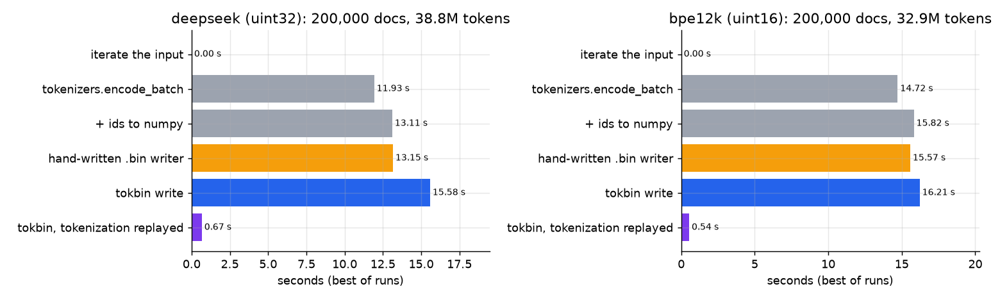

200,000 stories, each variant run 5 times in rounds (A B C, A B C, ...), best run:

| | deepseek | bpe12k |
|---|---|---|
| `tokenizers.encode_batch` alone | 11.93 s | 14.72 s |
| + ids to numpy (what any writer must do) | 13.11 s | 15.82 s |
| hand-written `.bin` writer (nanoGPT `prepare.py` style) | 13.15 s | 15.57 s |
| **tokbin write** | **15.58 s** | **16.21 s** |
| tokbin, tokenization replayed from a table | 0.67 s | 0.54 s |

The last row is tokbin's own work: normalizing documents, checking ranges, building
the stream, writing shards, `offsets`, `ids.jsonl`, id hashes, checksums, fsync,
checkpoints and the atomic rename. It is 5% of the tokenization time for deepseek
and 3.4% for bpe12k. The hand-written writer does none of that: no document index,
no ids, no checksums, no durability, no resume.

**The end-to-end difference is not well determined.** The five rounds above put
deepseek at +19% over plain tokenization, while the own work explains only 5%. The
same comparison in other runs gave the opposite sign. A direct test ran each variant
in a fresh process, three times (200,000 stories):

| | run 1 | run 2 | run 3 |
|---|---|---|---|
| tokbin | 14.0 s | 15.7 s | 14.2 s |
| plain tokenization | 14.7 s | 15.4 s | 13.5 s |

Process-to-process variation is about ±10% and larger than the effect being
measured. It is most likely the scheduling of threads on performance and efficiency
cores. On the full corpus (below), each of four paired runs had tokbin 5–15% slower
than plain tokenization. That is the honest range for end-to-end cost on this
machine: **between "not measurable" and 15%**, of which about 5% is accounted for
by tokbin's own CPU work.

### The whole corpus and memory

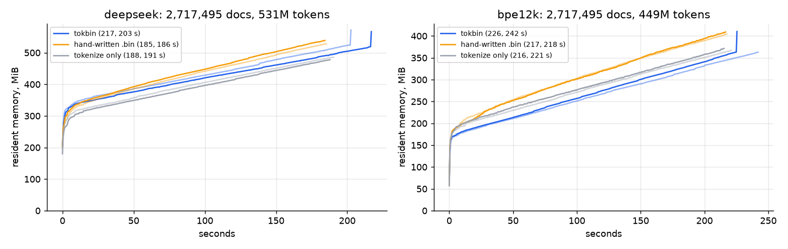

2,717,495 stories, each run in a fresh process, two rounds:

| | tokbin | hand-written | tokenize only |
|---|---|---|---|
| deepseek (531M tokens) | 217 s, 203 s | 185 s, 186 s | 188 s, 191 s |
| bpe12k (449M tokens) | 226 s, 242 s | 217 s, 218 s | 216 s, 221 s |
| peak memory, deepseek | 590 MiB | 539 MiB | 479 MiB |

Throughput is steady for the whole run: no stalls at shard boundaries, no slowdown
as the corpus grows. Resident memory grows by about 1 MiB/s in **all three**
variants, including plain tokenization, so the growth comes from the tokenizers
library and the allocator, not from tokbin. tokbin's own memory is the id hashes
(below) and a short step at the end, when duplicates are checked.

### Document length: the main limitation

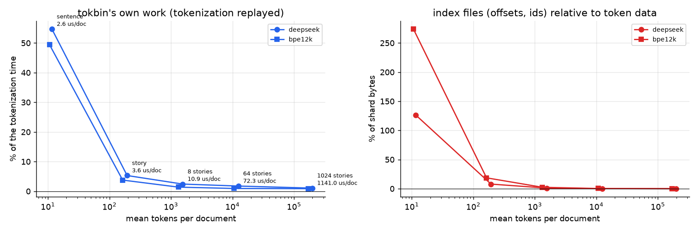

The same 200,000 stories written as sentences, as stories, and as documents joined
from 8, 64 and 1024 stories:

| documents | mean tokens | tokbin's own work, deepseek | share of tokenization | index files / token data (`uint32` / `uint16`) |
|---|---|---|---|---|
| 3,092,545 sentences | 12 | 8.1 s (2.6 µs/doc) | **55%** | **126% / 274%** |
| 200,000 stories | 194 | 0.71 s (3.6 µs/doc) | 5.3% | 7.9% / 18.6% |
| 25,000 × 8 stories | 1,553 | 0.27 s | 2.4% | 1.0% / 2.4% |
| 3,125 × 64 stories | 12,427 | 0.23 s | 1.8% | 0.1% / 0.3% |
| 196 × 1024 stories | 198,131 | 0.22 s | 1.0% | ~0 |

A useful model of tokbin's own work is **2.6 µs per document + 3–6 ns per token**.
The per-document part is Python work: the document object, one JSON line of
`ids.jsonl`, one blake2b hash of the id, an entry in two indexes. For documents of
a few hundred tokens and more it disappears in the tokenization time. For documents
of a dozen tokens (sentences, tweets, short chat turns) it is half the tokenization
time.

The index files have a fixed cost as well: `offsets.npy` and `ids.idx.npy` take 8
bytes per document each, and `ids.jsonl` takes the id plus ~11 bytes of JSON (47
bytes per document here). A 12-token document in `uint16` is 24 bytes of tokens and
about 63 bytes of index. **Join very short records into longer documents before
writing them** if you do not need to address them one by one.

Very long documents are not a problem for tokbin, but the deepseek tokenizer itself
became 1.7× slower on 800 KB documents (21.3 s for the same text), while bpe12k was
not affected.

### Tokenizer threads

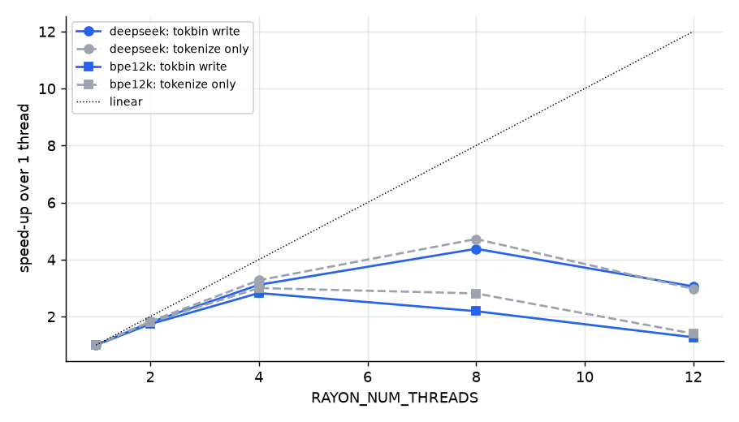

50,000 stories, `RAYON_NUM_THREADS` set per run (thousands of stories per second
for the tokbin write; plain tokenization behaves the same):

| threads | 1 | 2 | 4 | 8 | 12 (default) |
|---|---|---|---|---|---|
| deepseek | 4.8 | 8.7 | 15.0 | **21.1** | 14.7 |
| bpe12k | 9.2 | 15.9 | **25.9** | 20.1 | 11.7 |

Using all 12 cores is slower than using 8 (deepseek) or 4 (bpe12k): the 4
efficiency cores hold back the parallel batches. This is the tokenizers library, not
tokbin (plain tokenization shows the same curve), but it is the largest single
factor in write speed, larger than everything tokbin does. tokbin does not change
the environment of the process it runs in, so set it yourself:

```bash
RAYON_NUM_THREADS=8 tokbin build corpus/web --from-jsonl data/ --tokenizer tokenizer.json
```

Scaling is far from linear even on performance cores (4.4× on 8 threads for
deepseek). tokbin's own work does not shrink with more threads, so its share grows as
tokenization gets faster: at 8 threads the measured difference to plain tokenization
was 11% for deepseek.

### Batch size

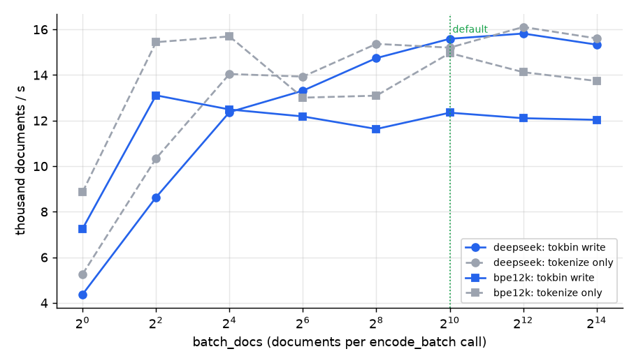

`batch_docs` is how many documents go to one `encode_batch` call. One document at a
time is 3.5× slower; from 64 documents on the curve is flat. The default of 1024
leaves no speed on the table. (Runs below 64 used the first 12,500 stories only, so
the two parts of the curve are not strictly comparable.)

### Shard size

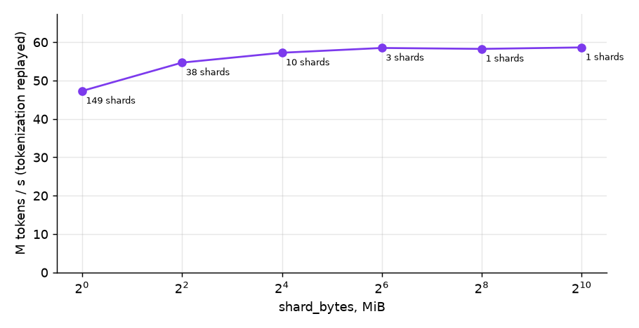

With tokenization replayed (the writer alone), 200,000 stories:

| `shard_bytes` | 1 MiB | 4 MiB | 16 MiB | 64 MiB | 256 MiB | 1 GiB |
|---|---|---|---|---|---|---|
| shards | 149 | 38 | 10 | 3 | 1 | 1 |
| M tokens / s | 47 | 55 | 57 | 58 | 58 | 59 |

Each closed shard costs about 1 ms (fsync, rename, checkpoint). With the default
512 MiB this is nothing; with shards of a few megabytes it is 20%, and reading gets
worse too (below).

### Interrupting and resuming

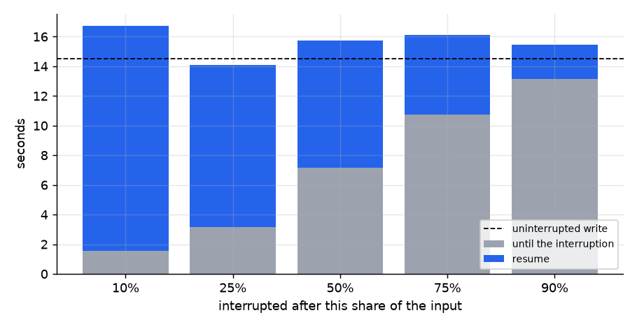

200,000 stories in 16 MiB shards (4.2M `uint32` tokens, about 21,000 stories per
shard), interrupted after a share of the input and resumed:

| interrupted after | 10% | 25% | 50% | 75% | 90% |
|---|---|---|---|---|---|
| inputs covered by the checkpoint | 0 | 42,968 | 85,816 | 129,013 | 171,902 |
| before + after the interruption | 16.7 s | 14.1 s | 15.8 s | 16.1 s | 15.4 s |
| uninterrupted write | 14.5 s | | | | |

Resuming is cheap in itself: already written inputs are iterated and their ids
compared, without tokenization. What is lost is the work since the last checkpoint,
and **a checkpoint is written only when a shard closes**. With the default 512 MiB
shards this is up to 134M `uint32` tokens (268M `uint16`), about 45 seconds of
tokenization on this machine; an interruption before the first shard closes (the
10% column) starts from the beginning.

### Duplicate id detection

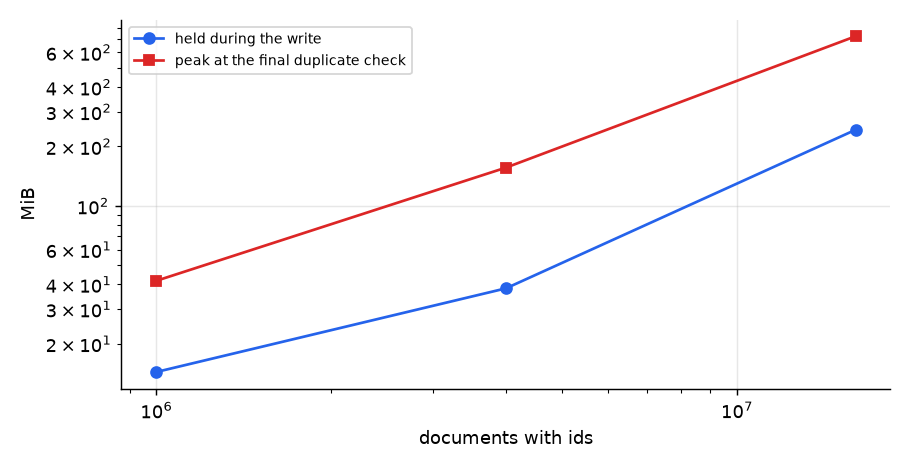

Every document id is kept as an 8-byte hash to report duplicate ids at the end:

| documents | held during the write | extra peak at the final check | final check |
|---|---|---|---|
| 1M | 15 MiB | 27 MiB | 0.1 s |
| 4M | 38 MiB | 118 MiB | 0.65 s |
| 16M | 243 MiB | 480 MiB | 5.6 s |

The check sorts all hashes once, which briefly needs about 32 bytes per document.
Extrapolated to 100M documents: ~1.5 GB during the write, a peak of ~3 GB more and
~40 s at the end of the write. Hashing costs ~350 ns per document (part of the 2.6 µs
above).

### Inputs

200,000 stories, deepseek:

| input | time | reading alone |
|---|---|---|
| Python list in memory | 12.9 s | |
| `tokbin build --from-jsonl` (one 170 MB file) | 13.4 s | 0.45 s |
| `tokbin build --from-txt` (200,000 files) | 22.0 s | 8.0 s |

JSON Lines costs almost nothing. A directory of one file per document costs ~40 µs
per file on APFS (open, read, close) and can dominate; prefer JSON Lines for many
small documents.

## Reading

All reads below are from the page cache (warm) unless marked cold. The source is the
full deepseek corpus: 530M `uint32` tokens in 4 shards, 2.7M documents.

### Single calls

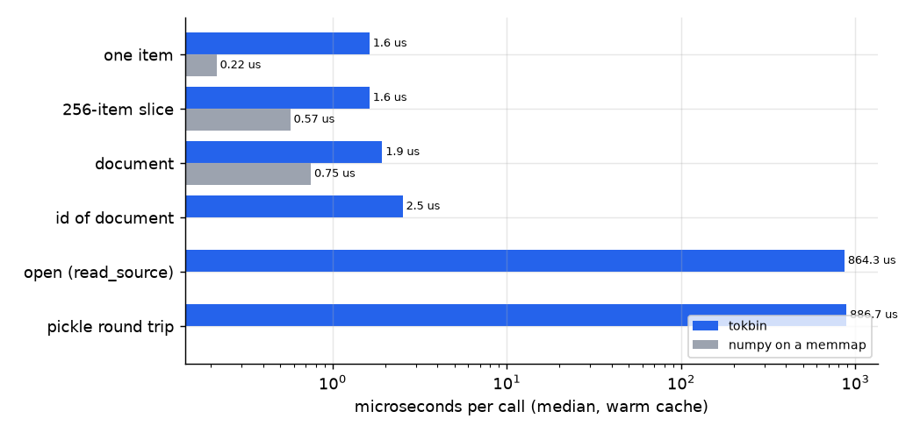

| call (median) | tokbin | numpy on a memmap |
|---|---|---|
| one item `src[i]` | 1.63 µs | 0.22 µs |
| 256-item window | 1.63 µs | 0.57 µs |
| document `doc(i)` | 1.93 µs | 0.75 µs |
| `id_of_doc(i)` | 2.52 µs | |
| `read_source` (open) | 0.86 ms | |
| pickle round trip (a DataLoader worker) | 0.89 ms | |

Every public call checks its arguments and bounds and finds the shard; that is about
1–1.5 µs over raw numpy. It does not matter for windows and documents, and it
matters a lot if you read **item by item**: iterating `src[i]` over a million tokens
takes 1.6 s. Read slices or windows instead.

### Windows

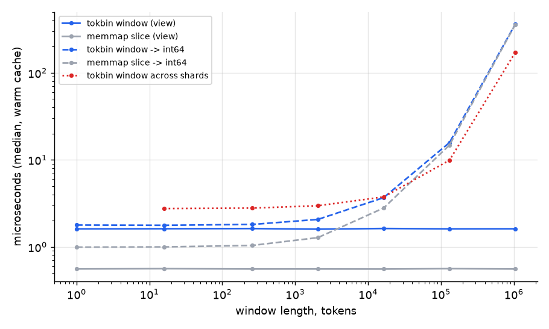

A window inside one shard is a view: 1.6 µs whatever its length, because no data is
read yet. The cost appears when the data is used; converting to `int64` for torch
takes the same time as with raw numpy (15.8 µs vs 14.8 µs for 131,072 tokens). A
window across a shard boundary is always copied: 3.0 µs for 2,048 tokens, 172 µs for
a million.

### Batches of random windows

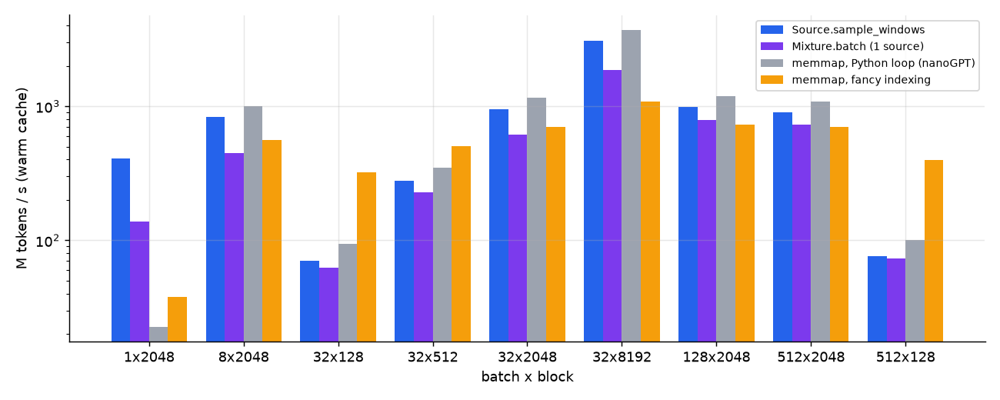

| batch × block | `sample_windows` | `Mixture.batch` (1 source) | numpy, Python loop | numpy, fancy indexing |
|---|---|---|---|---|
| 1 × 2048 | 5 µs | 15 µs | 90 µs | 54 µs |
| 32 × 2048 | 69 µs | 106 µs | 57 µs | 93 µs |
| 32 × 8192 | 85 µs | 141 µs | 71 µs | 241 µs |
| 512 × 2048 | 1.16 ms | 1.44 ms | 0.97 ms | 1.49 ms |
| 32 × 128 | 58 µs | 66 µs | 43 µs | **13 µs** |
| 512 × 128 | 862 µs | 896 µs | 648 µs | **164 µs** |

For typical language-model batches (32 × 2048) `sample_windows` delivers about a
billion tokens per second, 20% behind a hand-written loop and far beyond what a
training step consumes. **Many short windows are the weak spot:** the rows are read
one by one in Python (~1.7 µs each), and vectorized numpy is 4–5× faster for
512 × 128.

### Number of shards

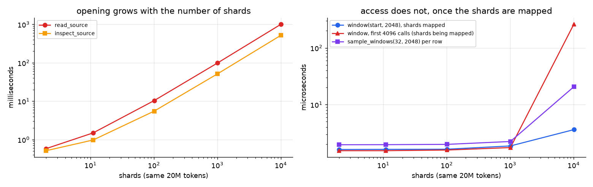

The same 20M tokens split into 2 … 10,099 shards:

| shards | 2 | 11 | 101 | 1,010 | 10,099 |
|---|---|---|---|---|---|
| `read_source` | 0.6 ms | 1.5 ms | 10 ms | 99 ms | **1.0 s** |
| `inspect_source` | 0.5 ms | 1.0 ms | 5.5 ms | 52 ms | 522 ms |
| `meta.json` | 0.9 KB | 2.8 KB | 21 KB | 204 KB | 2.0 MB |
| window, shards mapped | 1.6 µs | 1.6 µs | 1.6 µs | 1.9 µs | 3.6 µs |
| window, first calls (shards being mapped) | 1.5 µs | 1.5 µs | 1.6 µs | 1.8 µs | **262 µs** |

Finding a shard is a binary search and stays cheap. **Opening is linear in the number
of shards**: every shard is checked for presence and size, and `meta.json` lists
them all. So is the first access to each shard, which creates its memory map
(30–300 µs). Both are paid again by every DataLoader worker. With the default
512 MiB shards a 1 TB corpus has about 2,000 shards (~0.2 s to open); tiny shards
multiply that.

### Number of documents

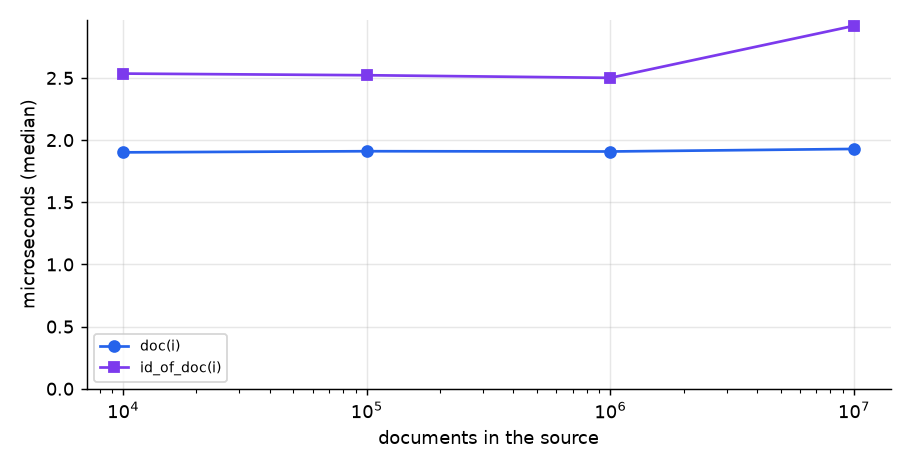

| documents | 10k | 100k | 1M | 10M |
|---|---|---|---|---|
| `doc(i)` | 1.90 µs | 1.91 µs | 1.91 µs | 1.93 µs |
| `id_of_doc(i)` | 2.54 µs | 2.52 µs | 2.50 µs | 2.92 µs |
| `read_source` | 0.52 ms | 0.52 ms | 0.49 ms | 0.51 ms |

`doc` and `id_of_doc` are O(1), and opening does not depend on the number of
documents: the indexes are memory-mapped, not loaded.

### Cold reads

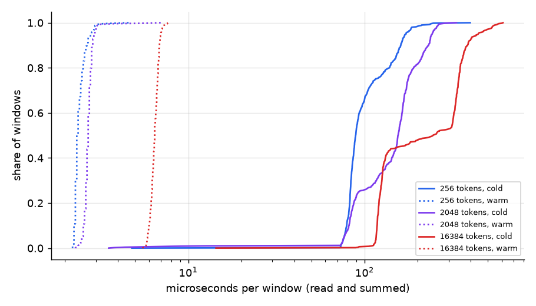

Copies of the source written with `F_NOCACHE`, so that the first read really goes to
the SSD:

| | cold (median / p99) | warm |
|---|---|---|
| window of 256 tokens, read | 89 / 211 µs | 2.3 µs |
| window of 2,048 tokens | 155 / 261 µs | 2.7 µs |
| window of 16,384 tokens | 244 / 548 µs | 6.5 µs |
| batch 32 × 2048 | 4.9 ms | 0.07 ms |
| `read_source` | 92 ms | 0.8 ms |
| `verify_source` (sequential, sha256) | 1.9 GB/s | 2.7 GB/s |

Random access to data that is not in memory costs a disk round trip per window,
40–100× the warm cost. On this SSD a cold 32 × 2048 batch still delivers 13M tokens
per second. On network storage or hard disks the latency per window is 10–1000×
higher; there, keep the corpus on a local disk or make sure it fits in memory.

### Memory while sampling

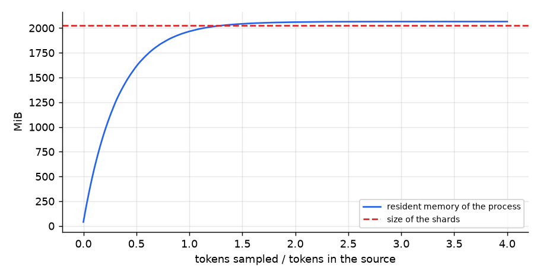

The resident memory of a process sampling random windows grows until it equals the
size of the shards (2 GB here) and stays there. These are file pages mapped into the
process: they belong to the page cache, are shared with other processes and are
released by the OS under memory pressure. Monitoring tools still show them as the
process's memory, and with several DataLoader workers each worker shows them again.
Plan RAM so that the corpus fits in the page cache if you sample it randomly; if it
does not, reads become cold reads.

### Mixtures

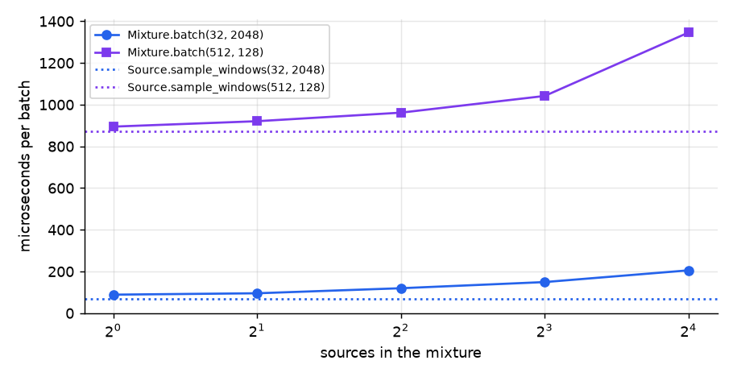

`Mixture.batch(32, 2048)` takes 89 µs with one source (69 µs for the source alone)
and 205 µs with 16 sources: drawing sources and grouping rows costs ~8 µs per
source.

### torch DataLoader

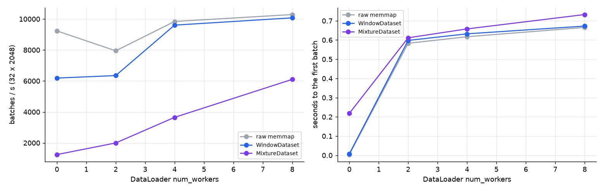

Batches of 32 × 2048 per second, shuffled, `spawn` workers:

| num_workers | 0 | 2 | 4 | 8 |
|---|---|---|---|---|
| hand-written memmap dataset | 9,234 | 7,946 | 9,842 | 10,289 |
| `WindowDataset` | 6,187 | 6,348 | 9,605 | 10,076 |
| `MixtureDataset` | 1,245 | 1,997 | 3,649 | 6,103 |

Starting workers takes ~0.6 s for all three (the source is reopened in each worker).
`WindowDataset` is 33% slower than raw numpy without workers and equal with 4 or
more. `MixtureDataset` creates a random generator per item (so that item *i* is
the same in any worker and any epoch): ~25 µs per item against ~5 µs for
`WindowDataset`, so it needs more workers for the same rate. All rates are far above a GPU's consumption for these
batch sizes.

A trap the comparison ran into: a hand-written dataset that keeps an open
`np.memmap` pickles **the whole mapped file** into every worker (5–13 s to start the
workers here). tokbin's `Source` pickles only its path.

## Storage

| | deepseek (`uint32`) | bpe12k (`uint16`) |
|---|---|---|
| tokens | 2,122 MB (92.2%) | 899 MB (84.0%) |
| `ids.jsonl` | 127 MB (5.5%) | 127 MB (11.8%) |
| `offsets.npy` + `ids.idx.npy` | 43 MB (1.9%) | 43 MB (4.1%) |
| tokenizer copy | 10 MB (0.4%) | 0.9 MB (0.1%) |
| total | 2,302 MB | 1,070 MB |

The size of the tokens is (number of tokens) × (bytes per token). A tokenizer with
up to 65,536 tokens stores 2 bytes per token; above that, 4. The index files depend
only on the number of documents and the length of their ids (~63 bytes per document
here), which is why their share doubles for `uint16`.

### pack

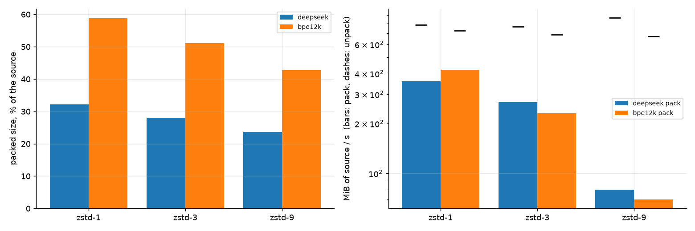

| method | deepseek: size, pack / unpack | bpe12k: size, pack / unpack |
|---|---|---|
| zstd-1 | 32%, 6.1 s / 2.8 s | 59%, 2.4 s / 1.4 s |
| **zstd-3** (default) | **28%**, 8.2 s / 2.9 s | **51%**, 4.4 s / 1.5 s |
| zstd-9 | 24%, 27.5 s / 2.5 s | 43%, 14.6 s / 1.5 s |

Compressed, both sources come to about the same size (647 MB and 547 MB), and to
about the size of the compressed text (zstd-3: 655 MB). The zero upper bytes of
`uint32` compress away, so the difference between 2 and 4 bytes per token largely
disappears in transfer. lzma and zstd-19 were not run on these sizes; an earlier run
of lzma-3 on the same 2.1 GB took 340 s (6 MB/s), which is why lzma is only the
fallback when zstd is missing.

## Known limitations

In order of practical impact:

1. **Tokenizer threads.** The default thread count of the tokenizers library can be
   30–55% slower than a smaller one on CPUs with efficiency cores. Set
   `RAYON_NUM_THREADS`.
2. **Short documents.** Around 2.6 µs and ~63 bytes of index per document; below
   ~50 tokens per document this dominates both write time and disk size.
3. **Tokenization and writing do not overlap.** The writer's work is added to the
   tokenization time instead of running while the next batch is tokenized.
4. **Many small shards.** Opening and first access are linear in the number of
   shards, and paid by each DataLoader worker.
5. **Small random windows.** `sample_windows` reads row by row; for many windows of
   a few hundred tokens it is 4–5× behind vectorized numpy.
6. **Checkpoint granularity.** A resumed write repeats up to one shard of work.
7. **Duplicate check at the end.** ~32 bytes per document for a few seconds per
   10M documents at the end of a write.
8. **Page-cache memory.** Random sampling makes the whole corpus resident; it is
   reclaimable, but looks like process memory.

## Method

- Compared variants run in rounds, so slow drifts of the machine (heat, background
  work) affect them alike; the tables show the best run, the JSON keeps all samples.
- Single calls are timed like `timeit`: repeated until a sample lasts 0.2 s, garbage
  collector off, 7 samples, median reported.
- "Tokenization replayed" substitutes a tokenizer that returns precomputed ids from a
  table. The output is byte-identical; the time is tokbin's own work.
- Runs whose memory is reported run in fresh subprocesses.
- Cold reads use copies written with `F_NOCACHE`; the first read of every page goes
  to the disk. The warm pass reads the same windows again.
- Not measured: Linux and Windows, network file systems, more than one writer at a
  time, corpora larger than the RAM of the machine.

Regression checks: `images/regress.py` runs a synthetic suite in about 40 s and
fails when a metric is more than 10% slower than `images/baseline.json`. On this
machine repeated runs stay within ±2% (±7% for mixtures), and an artificial 0.5 µs
slowdown of reads is caught on the six metrics it affects.
